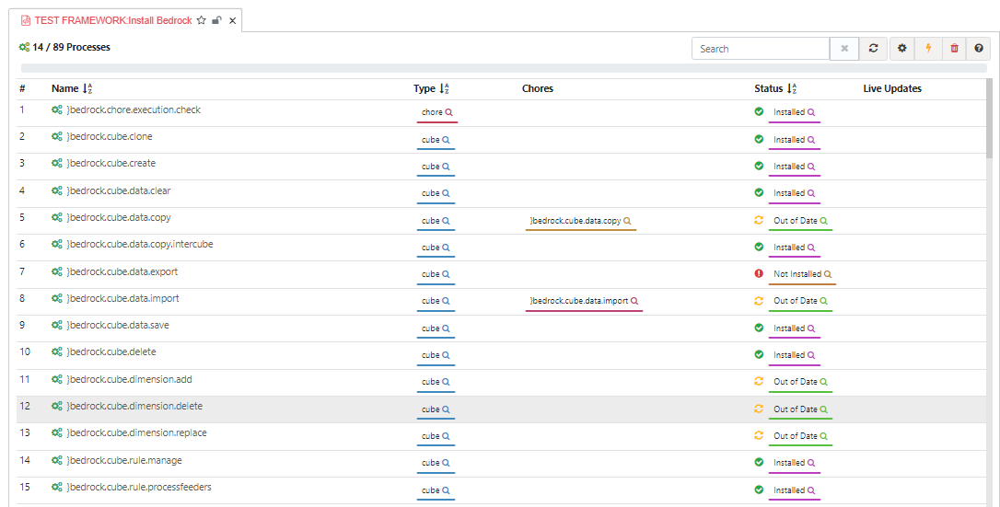

This is where the text for the atmosphere portal help doc goes.

All standard markdown is supported:

### Markdown Heading 3
## Markdown Heading 2
# Markdown Heading 1

### Lists:

- List Item 1
- List Item 2
  - Sublist Item 1
  - Sublist Item 2
- *Emphasis*
- **Bold**

### Numbered Lists:

1) `Inline Code`
1) Code blocks

    ``` javascript

    // This is a code block
    function hello() {
        console.log("Hello");
    }

    // Note that markdown syntax highlighting is NOT supported
    ```
    
1) [Links (opens in current tab)](https://www.atmospherejs.com)
1) [Links (opens in new tab)](https://www.atmospherejs.com){target="_blank"}

### Images

This is how you can link an image from the `images` directory - the bits in curly brackets are non-standard markdown extensions that allow us to specify css classes and a link target:

```
[{class="img-lg"}](images/overview.png){target="_blank"}
```

[{class="img-lg"}](images/overview.png){target="_blank"}

You can add more markdown files as needed. They will be added as tab in the help dialog -- please let us know the order in which they should appear.