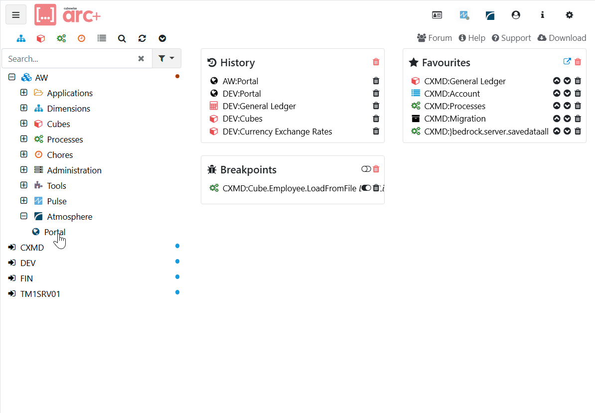

# Atmosphere UI for Arc

Welcome to the Atmosphere UI AddIn in Arc!
This extension provides a central interface for connecting, executing, and reviewing Atmosphere loads directly within your Arc environment.

[{class="img-lg"}](images/arc-atmosphere-plugin.gif){target="_blank"}

## Key Features

- **Register New Connections:** Easily set up connections to various data sources such as Salesforce, TM1, Snowflake, and more. This UI streamlines the process of onboarding new data integrations.

- **Execute & Parameterize Loads:** Launch Atmosphere loads with just a few clicks. Specify parameters (e.g., filters, date ranges, or target systems) to tailor each load to your exact needs.

- **Review Usage & History:** Access a detailed overview of recent executions, including load statuses, timings, and any relevant statistics. Stay informed about what has run, when, and how long it took.

- **View Execution Logs:** Dive into logs for previous Atmosphere runs. These logs offer insights into processed data, any errors or warnings encountered, and how to troubleshoot issues quickly.

## How to Use

1. **Open the Atmosphere UI in Arc:** Click the **Atmosphere** entry in the Arc navigation panel.
2. **Configure Your Connections:** In the **Connections** tab, click **Add** to register a new connection.
3. **Run a Load:** From the **Functions** tab, select an Atmosphere function, fill in any required parameters, then click **Run**.
4. **Check Your Execution History:** In the **Usage History** tab, you can see a timeline of past executions. Click on any entry for more details.
5. **Review Logs:** If you need to dive deeper, the **Logs** tab shows full logs for each run, including any errors.

## Need Help?

If you encounter any issues or have questions, feel free to reach out to the Atmosphere team or consult the support documentation. Enjoy your streamlined data operations with the Atmosphere UI AddIn for Arc TM1!